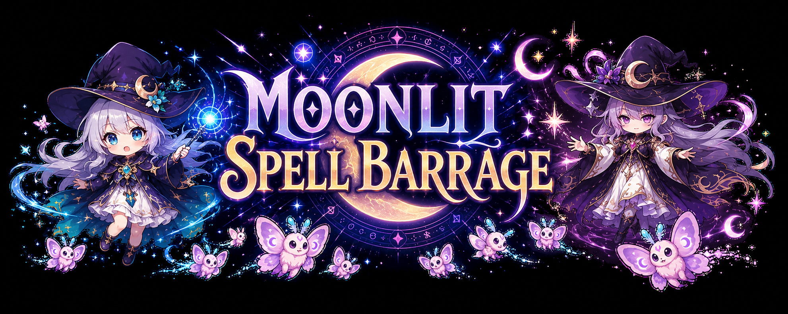

# Moonlit Spell Barrage

A browser-based 2D bullet-hell shooting game prototype built with TypeScript, Vite, and PixiJS.
Its stage flow, dense spell patterns, grazing, and boss-focused structure are inspired by Touhou Project.



## Play Online

Try the latest version at https://yoshy3.github.io/PrototypeActionGame/!

## Run Locally

```powershell
npm.cmd install
npm.cmd run dev
```

Open the local Vite URL shown in the terminal, usually `http://127.0.0.1:5173/`.

## Build

```powershell
npm.cmd run build
npm.cmd run preview
```

## Controls

- Start / confirm: Z, Space, Enter, mouse or touch on the boot screen, or gamepad confirm
- Select difficulty on title: Left/Right, A/D, or 1/2/3/4
- Move: Arrow keys, WASD, D-pad, or left stick
- Focus / slow movement: Shift or gamepad RB
- Shoot: Z, Space, or gamepad A
- Bomb: X or gamepad X
- Virtual gamepad: use the PAD toggle to show or hide touch controls; swipe from anywhere on the left side to move, and use Shoot to confirm menus and result screens
- Mute sound: M
- Pause: Esc or gamepad Start
- Pause menu: Esc/Start to resume, R to retry, hold Z/Space to return to title
- Result screens: R to retry, Z/Space/Enter to continue or return to title

Development builds also expose quick-start debug keys on the title screen for boss, later-stage, and ending checks.

## Current Scope

- Four-stage vertical bullet-hell run: Moonlit shrine approach, Starlight crystal corridor, Asteroid spell belt, and Fire storm
- Four boss encounters: Lunar Witch, Starlight Oracle, Cosmic Sorcerer, and Salamander
- Pre-boss warning cut-ins with boss standing artwork, subtitles, stage-specific voice clips, music ducking, skip input, and battlefield cleanup before combat resumes
- Five-phase boss spell patterns with petals, stars, split bullets, breakable shells, warning lasers, asteroid pressure, magma gates, cinder rain, flame wheels, and firestorm barrages
- Enemy waves with moth, crystal, astral familiar, dragon, and fire familiar sprites using fan, cross, snipe, wheel, laser, split-fan, breakable-wall, flame, and homing-flame patterns
- Beginner, Casual, Normal, and Lunatic difficulty presets that scale enemy HP, boss HP, bullet speed, firing delay, and score rewards
- Player movement, focused hitbox display, multi-level shots, lives, bombs, invincibility after damage, extends, score, pause, clear, game over, ending, and credit roll states
- Graze scoring for near-misses against enemy bullets and lasers
- Collectible score and bomb items, Lv1-Lv4 shot power, and an upper-screen auto-collect line
- Per-difficulty local high scores saved in browser storage, with clear and game-over result summaries
- Stage progress bar, boss HP and phase markers, warning banners, screen shake, bomb flash, floating score text, and clear-result effects
- Animated sprite sheets for player, enemies, bosses, asteroids, fire familiars, and fire projectiles, plus title, boss cut-in, and ending artwork
- MP3 background music for title, each stage, regular boss battles, final boss, clear, game over, and ending, with WAV sound effects, voiced boss cues, a mute toggle, and pause-aware audio levels

## Tech Notes

- Runtime: PixiJS 8 canvas renderer through Vite
- Source entry point: `src/main.ts`
- Core game orchestration: `src/systems/GameScene.ts`
- Stage scripting: `src/systems/StageScript.ts`
- Boss phase behavior and spell patterns: `src/systems/Boss.ts`
- Character and bullet visuals: `src/systems/VisualFactory.ts`
- Keyboard, pointer, touch, and gamepad input: `src/systems/Input.ts`
- Audio playback, asset-backed SFX, voice clips, music ducking, and fallback synthesized SFX: `src/systems/AudioSystem.ts`
- Generated images and audio live under `src/assets/**`; see `NOTICE` before reusing them outside this project

## License And Credits

See `LICENSE` and `NOTICE` for license details and asset/tool attribution.
